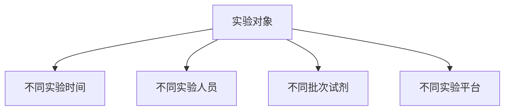
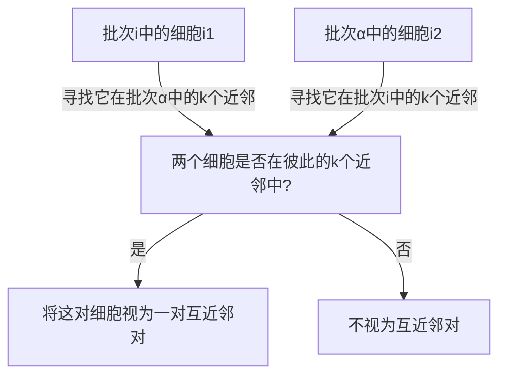

# ❗多批次数据整合
## 🔑 Key Points
### 批次效应
批次效应是指在不同条件下的测量值具有不同的数据表现，且这种数据表现的不同与生物学变量无关，是一种技术偏差。

#### 去除批次效应
- 去批次过程：批次效应是一种“噪声”，去除“噪声”揭示恢复底层的生物学结构/信息。
- 单细胞转录组整合算法分类： 
1. 基于批次效应和基因表达谱建模的方法：Combat, LIGER 
2. 基于在不同批次间寻找互近邻对MNNs的方法：BBKNN, Scanorama, Seurat v3, Harmony 
3. 基于深度学习的方法：scGEN, scGAN, iMAP
### 经典去批次效应算法
#### MNN
根据批次间的 MNN 对来消除批次效应。MNN 对被认为是批次之间最相似的相同类型的细胞，而细胞之间表达值的差异提供了对批次效应的估计，通过对许多 MNN 对的表达之差异作平均，可以更精确地对批次效应进行估计，进而从中获得一个校正向量，从而实现表达谱层面的矫正。
##### 三个假设
- 在两个批次中至少存在一个共有的细胞群
- 批次效应几乎与生物子空间正交
- 批次效应变异比不同细胞类型之间的生物效应变异小得多
##### 算法流程
1. **对细胞$x$的表达向量$Y_x$进行余弦归一化(将其模变为1), 然后对细胞计算余弦归一化表达谱之间的欧式距离:**
$$
7Y_x \leftarrow \frac{Y_x}{||Y_x||}
$$
> 在归一化数据上计算距离等价于在原始表达量上计算余弦距离. 而选择计算余弦距离是因为其对测序深度和不同批次间捕获率的技术差异具有更强的鲁棒性

2. **确定彼此之间的最近邻**

具体考虑两个批次的样本:
对批次1中的细胞 $i_1$，寻找它在批次2中的 k 个近邻；同样对批次2中的细胞 $i_2$，寻找它在批次1中的 k 个近邻；如果两个细胞在彼此的 k 个近邻中，那么就把这对细胞视为一对互近邻对。
3. **对每个MMN对, 计算一个MMN对特定的批次向量, 即对细胞的表达谱向量的差值**




```python
def compute_correction(data1, data2, mnn1, mnn2, data2_or_raw2, sigma):
    # 计算所有的 MNN pair-specific batch correction vector
    vect = data1[mnn1] - data2[mnn2]
    # 获取 Query 批次中, 有 MNN 的细胞的索引mnn_index以及该细胞的MNN 数mnn_count
    mnn_index, mnn_count = np.unique(mnn2, return_counts=True)
    # 将 Query 细胞对应的 MNN batch-correction 求平均， 如果某个细胞没有 MNN, 则 correction vector 为全0向量
    vect_reduced = np.zeros((data2.shape[0], vect.shape[1]), dtype=np.float32)
    for index, ve in zip(mnn2, vect):
        vect_reduced[index] += ve
    vect_avg = np.divide(vect_reduced[mnn_index], mnn_count.astype(np.float32)[:, None])
    # kdist(data2_or_raw2, data2_or_raw2[mnn_index]) 计算了所有细胞与每个有 MNN 的细胞的距离，记作 kdist,
    # 然后乘了个高斯核函数 np.exp(-kdist / sigma); 于是 exp_distance 大小为 n x m, 越相似的细胞则值越大
    exp_distance = np.exp(-kdist(data2_or_raw2, data2_or_raw2[mnn_index]) / sigma)
    # 计算有 MNN 的细胞的密度density, 即所有有 MNN 的细胞对彼此的距离的和
    density = np.sum(exp_distance[mnn_index], axis=0)
    # 计算权重mult, 其列和为 total_prob (非常接近 1), mult 的每列可以认为是有 MNN 的细胞与所有细胞的 (归一化的) 相似性
    mult = np.divide(exp_distance, density)
    total_prob = np.sum(mult, axis=1, keepdims=True)
    # 根据对每个有 MNN 细胞的相似性, 对所有 correction vector 加权和得到每个细胞特定的矫正向量, 最后除以total_prob 微调下结果
    output = np.dot(mult, vect_avg)
    return np.divide(output, total_prob)
```

#### Seurat
**Step 1.** 使用CCA分析将两个数据降维到同一个低维空间。CCA降维后的空间距离不是相似性而是相关性。所以相同类型与状态的细胞可以克服技术偏倚重叠在一起。 
**Step 2.** 运用MNN算法、表达矩阵计算经过CCA降维后的低维空间中的近邻对。在Seurat中将这些相互邻对称为“锚点”（Anchor）
**Step 3.** 修正不正确的锚点。 
1. 在CCA空间中找到的锚点，返回到原始基因表达矩阵高维空间中验证，如果它们的转录特征相似性高则保留，否则过滤掉此锚点
2. 检查锚点所在数据集最近邻的30个细胞，查看它们的锚点匹配对细胞的数量，重叠越多分值越高，代表锚点可靠性越高

#### Harmony
**Step 1.** Soft K-Means 聚类 & 最大多样性聚类 (Maximum Diversity Clustering) 
- 初始化设定 k 个类别和中心点坐标，通过类内距离最小化，类间距离最大化来优化点的 k 个类别标签和它们的中心点坐标。
- 最大多样性聚类：细胞 c2 距离 cluster1 有点远，本来不能算作 cluster1 的一份子；但是 c2 和 cluster1 的细胞来自不同的数据集，因为期望不同的数据集融合，所以破例让它加入 cluster1 了。
**Step 2.** "Experts Matrix" 批次校正 
- 计算每一个 cluster 的所有数据集的全局中心，以及特定数据集的中心 
- 在每个 cluster 中，基于中心为每个数据集计算校正因子，使用特定的细胞因子校正每一个细胞
#### Combat
- Combat 方式是一种基于经验贝叶斯方法去除批次效应的方法，尤其是对小样本数据更加有效。
- Combat 方法基于估计参数的先验分布，为每个基因独立估算每个批次的均值和方差并进行调整。
- 测量的基因表达形式如：
$$
x_{ijg} = \alpha_i + X \beta_i + \gamma_{ig} + \delta_{ig} \epsilon_{ijg}
$$
> 其中，$x_{ijg}$ 表示批次 $g$ 中样本 $j$ 基因 $i$ 的表达测定值。$\alpha_i$ 为基因的平均表达，$X$ 为样本条件的设计矩阵，$\beta_i$ 为对应 $X$ 矩阵的回归系数的向量，$\epsilon_{ijg}$ 为假设服从 $N(0, \sigma_i)$ 的高斯分布差项，$\gamma_{ig}$ 和 $\delta_{ig}$ 为批次 $g$ 中基因 $i$ 加性和乘性批次效应。

- 基因表达经过标准化后为，  
$$
Z_{ijg} = \frac{x_{ijg} - \hat{\alpha}_i - X \beta_i}{\hat{\delta}_i}
$$
- 假设 $Z_{ijg} \sim N(\gamma_{ig}, \delta_{ig})$，用最小二乘法估计 $\hat{\alpha}_i$，$\beta_i$ 和 $\gamma_{ig}$，采用参数先验或非参数先验方法计算出批次效应估计值 $\gamma_{ig}$ 和 $\delta_{ig}$。$\hat{\delta}_i$ 为所有样本中基因 $i$ 的标准差。其中参数先验方法要求 $\gamma_{ig} \sim N(\gamma_i, \tau_i^2)$ 以及 $\delta_{ig}^2 \sim InverseGamma(\lambda_i, \theta_i)$。  
- 最终的批次效应调整后的数据如下：  
$$
x_{ijg} = \frac{\hat{\delta}_i}{\delta_{ig}} (Z_{ijg} - \gamma_{ig}) + \hat{\alpha}_i + X \beta_i
$$
>其中，$x_{ijg}$ 为调整后的基因表达数据，$Z_{ijg}$ 为标准化的基因表达值。

#### Deep Learning Methods
##### 残差模型
将不同批次的数据输入到残差模型中，经过残差模型学习后，采用最大化不同批次数据间的均值差异策略来实现模型参数的优化。
##### 生成对抗学习
源自于图像的风格迁移，对不同批次的数据进行学习并相互生成，实现批次效应去除。
##### 域自适应
源于迁移学习，将数据的批次效应当成不同批次数据间的分布不同，通过深度学习模型调整不同域之间的分布差异，以实现批次效应去除。
### 批次效应评估指标
#### K-nearest-neighbor Batch-Effect Test (kBET)  
运用 $\chi^2$ 检验方法，验证在局部区域中的不同批次数据的分布与整体数据中数据批次的分布的一致性。
零假设：数据不存在批次效应。 
$\chi^2$ 分布：$\kappa_j^k = \sum_{i=1}^{l} \frac{(n - f_i \times k)^2}{f_i \times k} \sim \chi_{l-1}^2$ 
 P 值：$p_j^k = 1 - F_{l-1} (\kappa_j^k)$ 
>其中，$\chi_{l-1}^2$ 表示自由度为 $l-1$ 的 $\chi^2$ 分布，$n$ 表示在局部区域中观测到的每个批次的频数，$f_i$ 表示期望的批次分布，$k$ 为局部区域包含的样本数。$F_{l-1}$ 表示自由度为 $l-1$ 的 $\chi^2$ 分布的累积概率密度函数。

#### Local Inverse Simpson's Index (LISI) 
源自于 Simpson 多样性，通过计算局部区域内不同批次数据的概率分布，或局部区域内不同细胞类型的概率分布，并将每个局部区域中的概率取平均并取反，以此评估在局部区域中不同数据的混合是否均匀。 
$$
LISI(x_i) = \frac{1}{\sum_{y \in Y} P(y|x_i)^2}
$$ 
> 其中，$x_i$ 表示局部区域中第 $i$ 个细胞，$y$ 表示第 $i$ 个细胞所属的数据批次或细胞类型，$P(\ast)$ 表示局部区域中第 $i$ 个细胞属于 $y$ 类型的概率。

#### 平均轮廓系数（Average Silhouette Coefficient） 
- 计算样本 $i$ 到同簇其他样本的平均距离 $d_i$。$d_i$ 越小，说明样本 $i$ 越应该被聚类到该簇。将距离 $d_i$ 称为样本 $i$ 的簇内不相似度。簇 $C$ 中所有样本距离 $d_i$ 的均值，称为簇 $C$ 的簇不相似度。 
- 计算样本 $i$ 到其他某簇 $C_j$ 的所有样本的平均距离 $d_i'$，成为样本 $i$ 与簇 $C_j$ 的不相似度。定义样本 $i$ 的簇间不相似度：$d_i' = \min(d_{i1}', d_{i2}', ..., d_{ij}')$。$d_i'$ 越大说明样本 $i$ 越不属于簇 $C_j$。 
- 根据样本 $i$ 的簇内不相似度 $d_i$ 和簇间不相似度 $d_i'$，定义样本 $i$ 的轮廓系数： 
$$
s(i)=\frac{d_i'-d_i}{max(d_i'-d_i)}
$$
$$
s(i) = \begin{cases} 1 - \frac{d_i}{d_i'} & d_i < d_i' \\ 0 & d_i = d_i' \\ \frac{d_i'}{d_i} - 1 & d_i > d_i' \end{cases}
$$
> $s(i)$ 接近 1，说明样本 $i$ 聚类合理；$s(i)$ 接近 -1，说明样本 $i$ 更应该分到另外的簇；若$s(i)$ 近似为 0，说明样本在两个簇的边界上。

#### 调整兰德系数（Adjusted Rand Index, ARI）
见第四课, 细胞分群
