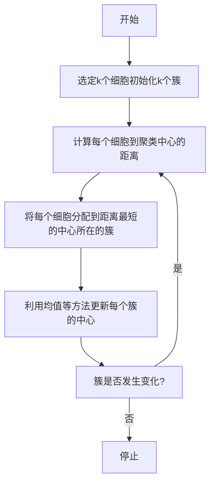
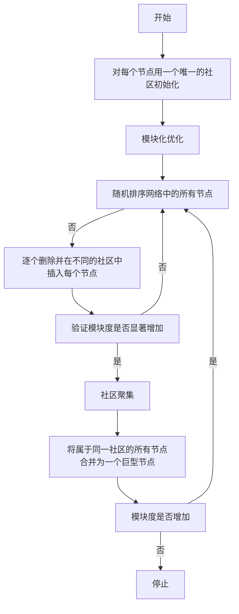
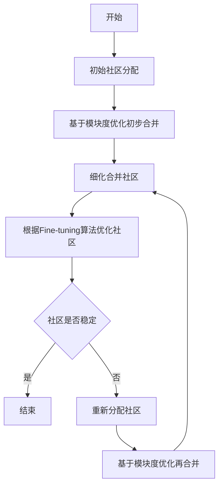

# ❗时空组细胞分群算法原理、思想及应用

## 🔑 Key Points
>空间转录组数据可以同时提供高通量基因表达谱和组织的空间结构。
>细胞分群是空间转录组数据分析的重要一步，也是下游深入分析的基础。后续研究诸如细胞类型注释、差异表达等均依赖于有效的分群。

**基本思想**: 细胞分群是一个把细胞集合划分成子集的过程，每个子集是一个簇，使得簇中的对象彼此相似，但与其他簇中对象彼此相异。
**基本原则**: 使簇内的相似性最大, 而簇间的相似性最小

## ❓ Questions
>[!attention]
>针对空间转录组, 如何更好的结合基因表达信息和空间位置信息, 以进一步挖掘计算细胞间的相似性是最主要的问题

## 📃 Summary of Notes

### 基于传统机器学习的方法

#### k-means聚类
- 应用: 细胞分群
> 选择较大的k值, 会提高分群的准确度, 但同时会增大过拟合的风险

- 优点：
    1. 易理解，聚类效果好；
    2. 处理大数据集时，能保证较好的伸缩性；
    3. 当簇近似高斯分布的时候，效果非常好；
    4. 算法复杂度低。
- 缺点：
    1. K值需要人为设定，且对K值敏感；
    2. 对初始质心（簇摩泽华绩准斯瘊图谱研窈值敏感；
    3. 不适合太离散的，样本类别不平衡的，非凸形状的聚类；
    4. 算法聚类时，容易产生空簇;
    5. 算法可能收敛到局部最小值.
    
#### Louvain
- 应用: 细胞分群, 社区发现

模块度定义:
$$
H=\frac{1}{2m}\sum_c\left[ e_c-\gamma\frac{k_c^2}{2m} \right]
$$
> 其中m为总边数, $e_c$为社区C内的边数, $k_c$为社区C中节点数的和, $\gamma$为参数分辨率
> 此公式的问题: 分辨率越高社区越多, 分辨率越低社区越少

- 优点
	- 快速, 准确
- 缺点
	- 社区划分的精确度有限
	- 分群内细胞分布密度大小会影响亚群的鉴定
	- 被鉴定为同一个分群的细胞内群体会存在两个没有连线的小分群

#### Leiden
模块度定义:
$$
H=\sum_c\left[e_c-\gamma\left(\begin{align}&n_c\\&2\end{align}\right)\right]
$$
> 其中社区内的密度至少为$\gamma$, 而社区间的密度不能超过$\gamma$, 
> 解决Louvain中"分辨率越高社区越多, 分辨率越低社区越少"的问题

- 优点: 运行速度比Louvain更快, 获得的集群可用性更高
- 缺点: 仍旧依赖在局部移动节点以分配簇的贪婪步骤, 容易陷入局部最优解

### 基于神经网络的方法

#### SpaGCN
算法:
- 首先，基于xyz坐标计算点之间的欧式距离（Z：H&E图像三通道的加权平均）。
- 然后，利用高斯过程模型中常用的协方差矩阵约束空间邻域图中边的权值与距离呈高斯核负相关。
- 最后，利用卷积层将基因表达矩阵的前50个PCs与该空间邻域图融合，并对其输出进行Louvain聚类和迭代精化，来识别空间区域。
优缺点: 
- 优点：在训练过程中，通过动态地更新图中边的权重，来更好地聚合邻域基因表达信息。(所有神经网络方法都有的优点)
- 缺点：基因表达的低维嵌入主要由PCA获得，因此空间域的检测主要还是由基因表达驱动，可能会在检测区域与底层组织解剖结构之间产生差异。

#### [**CCST**](https://github.com/xiaoyeye/CCST)
应用
- 细胞分群
- 细胞亚型发现
算法
- 1. 构建邻接矩阵。先根据细胞的xy坐标计算细胞之间的距离并用其构建邻接矩阵，其中当两个点的距离小于某个值时，邻接值为1，否则为0。再加上加权单位矩阵获得最终的邻接矩阵。
- 2. 通过一个图对比学习方法DGI提取细胞低维嵌入，其中，通过最大化节点级特征和图级特征的互信息优化模型
- 3. 将模型输出的嵌入用于后续的聚类和分析



优点
- 对比学习与聚类的指导原则一致，都是最小化相似点间的距离，最大化不相似点间的距离，因此有利于分群任务。
- DGI的损失函数中进一步考虑了全局的结构信息。 
缺点
- 是图对比学习由于需要挖掘负样本，空间使用率高

### 基于概率图模型的方法
#### BayesSpace
应用：
- 细胞分群
- 提高ST数据分辨率
算法：
- 1. 利用PCA等方法将ST或Visium数据投影到低维空间。
- 2. 对于每个点，用一个带有预定义簇数量的高斯混合模型建模该点的低维投影。对于ST数据，空间邻域图为正方形点网格，对于Visium数据，空间邻域图为六边形网格。
- 3. 利用马尔可夫随机场MRF先验鼓励相邻点分配到同一簇。
优点：不需要独立的单细胞数据
缺点：仅考虑了ST和Visium平台的数据中存在的邻域结构

#### DR-SC
应用：
- 细胞分群
- 轨迹推断
算法：
- DR step: 利用PCA等算法降维
- SC step: 利用BayesSpace进行空间聚类
- 将上述两步骤统一，并利用期望最大化(EM)算法通过最小化图中的公式由上一步得到的簇估计进一步优化降维和聚类
优点：它能端到端地进行特征降维和聚类
缺点：EM算法本质上是非凸的，易陷入局部最优解

## 分群效果评估

### 指标

#### 外部指标：
需要一个参考模型，这个参考模型通常是由专家给定的，或者是公认的参考模型比如公开数据集（有标签的、人工标准或基于一种理想的聚类结果），通过将聚类算法的聚类结果和已知的相比，从而衡量设计的聚类算法的性能、优劣。

##### 调整兰德指数（ARI）
- 测量两个聚类分配的相似性
- 取值范围为[-1,1]，越接近1越好
- 计算ARI的值需要先计算出列联表
$$
\begin{array}{c|cccc|c}
  & Y_1 & Y_2 & \cdots & Y_s & \text{Sums} \\
\hline
X_1 & n_{11} & n_{12} & \cdots & n_{1s} & a_1 \\
X_2 & n_{21} & n_{22} & \cdots & n_{2s} & a_2 \\
\vdots & \vdots & \vdots & \ddots & \vdots & \vdots \\
X_r & n_{r1} & n_{r2} & \cdots & n_{rs} & a_r \\
\hline
\text{Sums} & b_1 & b_2 & \cdots & b_s & 
\end{array}
$$
其中， $X = \{X_1, X_2, \ldots, X_r\}$ 表示真实的簇，$Y = \{Y_1, Y_2, \ldots, Y_s\}$ 表示聚类得到的簇，$n_{ij}$ 表示同时时位于簇 $X_i$ 和 $Y_i$ 的细胞个数
$$
\text{Adjusted Index (ARI)} = \frac{\overbrace{\sum_{ij} \binom{n_{ij}}{2}}^{\text{Index}} - \overbrace{\left[ \sum_i \binom{a_i}{2} \sum_j \binom{b_j}{2} \right] / \binom{n}{2}}^{\text{Expected Index}}}{\underbrace{\frac{1}{2} \left[ \sum_i \binom{a_i}{2} + \sum_j \binom{b_j}{2} \right]}_{\text{Max Index}} - \underbrace{\left[ \sum_i \binom{a_i}{2} \sum_j \binom{b_j}{2} \right] / \binom{n}{2}}_{\text{Expected Index}}}
$$
其中 
$$
\binom{n}{p} = \frac{n!}{(n-p)! p!}
$$

##### 归一化互信息(NMI)
- 测量两个聚类分配的相似性
- 取值范围为 $[0, 1]$，越接近1越好
- 公式如下：
$$
NMI(X, Y) = \frac{I(X; Y)}{(H(X) + H(Y))/2}
$$
$$
I(X; Y) = \sum_i \sum_j P(x_i \cap y_j) \log \frac{P(x_i \cap y_j)}{P(x_i) P(c_j)} = \sum_i \sum_j \frac{|x_i \cap y_j|}{N} \log \frac{N |x_i \cap y_j|}{|x_i| |y_j|}
$$
$$
H(X) = - \sum_i P(x_i) \log P(x_i) = - \sum_i \frac{|x_i|}{N} \log \frac{|x_i|}{N}
$$

##### Fowlkes - Mallows index (FMI)
- 测量两个聚类分配的相似性
- 取值范围为 [0, 1]，越接近1越好
- 公式如下：
$$
FMI = \frac{TP}{\sqrt{(TP + FP)(TP + FN)}}
$$
 > True Positive (TP): 真实簇和生成簇中属于同一簇的数量
 > False Positive (FP): 在真实簇而不在生成簇的数量
 > False Negative (FN): 不在真实簇而在生成簇的数量

#### 内部指标：
不需要基准数据集，不需要借助于外部参考，只考虑聚类之后这些簇之间的效果，通常利用样本数据集巾样本点与聚类中心之间的距离来衡量聚类结果的优劣。
- CH指标
- 轮廓系数
- DB指标
- 簇内平方和
