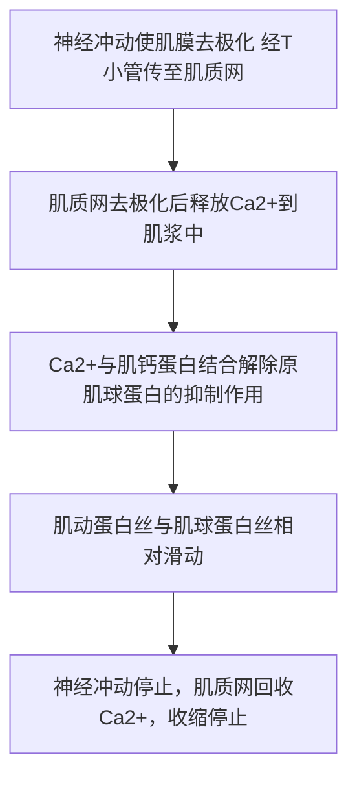

```txt
 ____             __                    __              ___           __
/\  _`\          /\ \__                /\ \            /\_ \         /\ \__
\ \ \/\_\  __  __\ \ ,_\   ___     ____\ \ \/'\      __\//\ \      __\ \ ,_\   ___     ___
 \ \ \/_/_/\ \/\ \\ \ \/  / __`\  /',__\\ \ , <    /'__`\\ \ \   /'__`\ \ \/  / __`\ /' _ `\
  \ \ \L\ \ \ \_\ \\ \ \_/\ \L\ \/\__, `\\ \ \\`\ /\  __/ \_\ \_/\  __/\ \ \_/\ \L\ \/\ \/\ \
   \ \____/\/`____ \\ \__\ \____/\/\____/ \ \_\ \_\ \____\/\____\ \____\\ \__\ \____/\ \_\ \_\
    \/___/  `/___/> \\/__/\/___/  \/___/   \/_/\/_/\/____/\/____/\/____/ \/__/\/___/  \/_/\/_/
               /\___/
               \/__/
```

细胞骨架(cytoskeleton):是指在细胞质内的一个复杂的纤维状网架结构, 这种结构通常被称为细胞骨架。细胞骨架主要包括<font color="#ff0000">微丝</font>、<font color="#ff0000">微管</font>和<font color="#ff0000">中间丝</font>3种结构组分。细胞骨架是动态结构, 在细胞运动、物质运输、能量转换、信息传递和细胞分化等一系列方面起重要作用。

细胞骨架具体功能为:

1. 细胞骨架构成多种细胞结构。
2. 细胞骨架为细胞提供结构支撑, 维持细胞形态。
3. 细胞骨架介导细胞内物质运输、细胞器运输, 参与信号转导。
4. 细胞骨架介导细胞运动。
5. 细胞骨架对细胞分裂起到重要作用。
6. 细胞骨架是细胞内结构与功能的空间组织者。
7. 细胞骨架参与蛋白质翻译: 锚定mRNA翻译复合体。
8. 细胞内生物大分子或细胞器的分布具有不对称性, 这与细胞骨架的不同组织方式有关, 其结构与功能相适应。

## 微丝与细胞运动

### 微丝的组成及其组装

微丝(microfilament, MF): 又称肌动蛋白丝(actin filament), 或纤维状肌动蛋白, 微丝的主要结构成分是<span style="background:rgba(255, 183, 139, 0.55)">肌动蛋白</span>, 是直径约为7nm的骨架纤维, 存在于所有真核细胞中。微丝在细胞收缩(如肌细胞)和物质运输等过程中发挥重要作用。

#### 结构与成分

微丝的主要结构成分是<span style="background:rgba(255, 183, 139, 0.55)">肌动蛋白</span>。

肌动蛋白(actin)：是微丝的结构蛋白，在生物进化过程中是高度保守的。在细胞内有两种存在形式，即肌动蛋白单体和由单体组装而成的纤维状肌动蛋白。

有一个裂缝将肌动蛋白分成两瓣，在裂缝内部有个核苷酸(ATP 或 ADP)和一个二价阳离子($Mg^{2+}$或$Ca^{2+}$的结合位点。裂缝使得该蛋白本身在结构上具有不对称性，在整根微丝上每一个单体上的裂缝都朝向微丝的同一端，从而使微丝在结构上具有极性。具有裂缝的一端为负极，而相反一端为正极。

#### 微丝的组装与其动力学特性

在试管中, 微丝的组装/去组装与溶液中所含肌动蛋白的状态(结合ATP或ADP)、离子的种类及浓度等参数相关联。只有结合ATP的肌动蛋白才能参与微丝的组装。当溶液中含有适当浓度的Ca2+, 而Na+、K+的浓度很低时, 微丝趋向于解聚;

而当溶液中含有ATP、Mg2+ 以及较高浓度的Na+、K+时, 溶液中的G-actin则趋向于组装成F-actin,即新的G-actin加到微丝末端, 使微丝延伸。由于纤维两端在结构上存在差异, 通常是微丝正极(+)的组装速度较负极(-)快。

成核反应(nucleation): 在细胞骨架纤维的组装过程中, 构成骨架的基本构件(如微管蛋白、肌动蛋白)在一定的调节下形成一个核心, 这一核心具有指导进一步装配的作用。微丝组装过程:

1. 成核反应: 由成核蛋白Arp2、Arp3构成微丝起始复合物, 介导微丝开始组装。肌动蛋白与起始复合物结合, 形成可供组装的寡聚体。此步为限速步骤。
2. 延伸反应: 肌动蛋白具有ATP酶活性, G-actin-ATP与寡聚体末端结合, 水解ATP, 从而介导微丝延长。正极组装速度快于负极, 新的单体多添加于正极。
3. 当微丝组装至一定程度时, G-actin浓度下降, 组装速率不断下降, 组装与去组装达到平衡, 微丝延伸进入稳定期。

ATP帽的形成: 当微丝的组装速度快于肌动蛋白水解ATP的速度时, 处于微丝末端的一些肌动蛋白亚基所携带的ATP还没有来得及水解, 即有一个由肌动蛋白-ATP亚基所构成的帽, 带有这种结构的微丝比较稳定, 可以持续组装。

当末端的肌动蛋白亚基所结合的是 ADP 时，则构成这段微丝的肌动蛋白亚基比较容易解聚。由于微丝两端在结构上存在差异，新的肌动蛋白亚基通常在正极端加入，而很少在负极端加入。

微丝**组装的调控**

(1)离子浓度

当系统中含有一定浓度的$Ca^{2+}$, 而$Na^+$、$K^+$浓度较低时, 微丝倾向于去组装。

当系统中含有一定浓度的Mg 2＋、ATP, 而Na＋、K＋浓度较高时, 微丝倾向于组装。

(2)底物浓度

当G-actin-ATP浓度较高时, 微丝的组装速度大于末端ATP的水解速度, 使微丝末端形成ATP帽子结构, 使微丝稳定延长。

当G-actin-ATP到达临界浓度时, 微丝组装与去组装达到平衡。

当G-actin-ATP浓度较低时, 微丝的组装速度小于末端ATP的水解速度, 使微丝末端形成ADP帽子结构, 使微丝倾向于去组装。

(3)特异性底物

- 细胞松弛素: 能够与微丝结合并将之切断, 并结合于微丝末端以阻止G-actin与之结合, 从而抑制微丝组装, 但不影响微丝去组装。故用细胞松弛素B处理细胞能够破坏细胞中的微丝网络, 从而阻止细胞运动。但对MT、肌肉中的肌动蛋白无作用。
- 鬼笔环肽: 能够与微丝结合并抑制其去组装, 使微丝保持稳定。故用鬼笔环肽处理细胞能够破坏微丝的动态平衡, 从而阻止细胞运动。

(4)微丝结合蛋白(非马达蛋白)

a. **单体结合蛋白**

细胞中G-actin:F-actin = 1:1, 即游离的G-actin浓度远远高于体外组装时的G-actin浓度, 这是由于细胞中存在多种G-actin单体结合蛋白。

> eg: 单体隔离蛋白, 胸腺素β4, 与G-actin结合, 抑制其组装。胸腺素β4与带ATP的肌动蛋白亲和力高于带ADP的肌动蛋白。

单体聚合蛋白, 前纤维蛋白, 与G-actin-ATP正极结合, 促进其组装。

b. **成核蛋白**

> eg: Arp2、Arp3, 在微丝组装时起到成核作用, 与微丝负极相连。也可以与已有的微丝侧向结合, 从而介导形成分支的微丝网络。

c. **加帽蛋白**: 此类蛋白通过同肌动蛋白丝的一端或两端的结合调节肌动蛋白丝的长度。在微丝的正极, 因CapZ或凝溶胶蛋白超家族的成员而被加帽。凝溶胶蛋白和加帽蛋白的脱帽作用都受细胞膜上PIP2的调节, 而PIP2的水平受细胞膜上G蛋白偶联受体的调节。

d. **交联蛋白**: 这类蛋白的主要功能是改变细胞内肌动蛋白丝的三维结构。

细胞内微丝的排列方式主要有两种: 束状排列和网状排列。排列方式主要由微丝交联蛋白的种类决定。

I. 成束蛋白: 将相邻的微丝交联成平行排列。

丝束(毛缘)蛋白: 横向连接相邻微丝, 形成排列紧密的微丝束, 主要发生在细胞前缘的丝状伪足中。由于微丝束排列紧密, 使得依赖于微丝运动的肌球蛋白分子难以进入, 因此丝状伪足中的微丝束没有收缩能力。

绒毛蛋白: 是另一种与丝束蛋白相似的成束蛋白。该蛋白主要存在于微绒毛和细胞表面的指状突起中, 将微丝交联成紧密排列的束状结构。微绒毛中的核心微丝束通过肌球蛋白Ⅰ与微绒毛膜相连。

II. 凝胶形成蛋白: 将微丝连接成网状。

III. α-辅肌动蛋白: 该蛋白形成反向平行的二聚体, 两个肌动蛋白结合位点相距较远, 因此, 由α-辅肌动蛋白交联形成的微丝束中相邻的微丝之间的距离较大。Α-辅肌动蛋白负责收缩性微丝束(如应力纤维)中肌动蛋白纤维之间的交联, 相对于宽松的排列方式使得肌球蛋白Ⅱ容易进入, 使得应力前卫具有收缩能力。

e. **切割及解聚蛋白**

这类蛋白能够同已经存在的肌动蛋白丝结合并将它们一分为二。

凝溶胶蛋白: 在高Ca2+浓度(>1umol/l)情况下能将较长微丝切割成片段, 使肌动蛋白由凝胶状态向溶胶态转化。

丝切蛋白/肌动蛋白解聚因子: 能与肌动蛋白单体或微丝结合。提高微丝的解聚速度。

f. **膜结合蛋白**

是非肌细胞质膜下方产生收缩的机器。在剧烈活动时, 由收缩蛋白作用于质膜产生的力引起质膜向内或向外移动。

装配的调节因素:

1. 游离G-actin的浓度;
2. 微丝横向连接成束或者成网的程度;
3. 微丝结合蛋白的调节。

踏车行为(treadmilling): 在体外组装过程中有时可以见到微丝的正极由于肌动蛋白亚基的不断添加而延长, 而负极则由于肌动蛋白亚基去组装而缩短, 这一现象称为踏车行为, 在试管中可以观察到单根微丝的踏车行为。

#### 影响微丝组装的特异性药物

细胞松弛素(cytochalasin): 是一组真菌的代谢产物, 与微丝结合后可以将微丝切断, 并结合在微丝末端阻抑肌动蛋白在该部位的聚合, 但对微丝的解聚没有明显影响, 因而用细胞松弛素处理细胞可以破坏微丝的网络结构, 并阻止细胞的运动。

鬼笔环肽(phalloidin): 是一种由毒蕈产生的双环杆肽, 与微丝表面有强亲和力, 但不与肌动蛋白单体结合, 能阻止微丝的解聚, 使其保持稳定状态, 因而破坏了微丝的聚合和解聚的动态平衡。用荧光标记的鬼笔环肽染色可清晰地显示细胞中微丝的分布。将鬼笔环肽注射到细胞内能阻止细胞运动。

### 微丝网络结构的调节与细胞运动

#### 非肌肉细胞内微丝的结合蛋白

根据微丝结合蛋白作用方式的不同, 可以将其分成如下几种类型

1.**肌动蛋白单体结合蛋白**: 在细胞内, 可溶性的肌动蛋白单体和纤维状肌动蛋白的比例大体是1:1。也就是说, 细胞内游离态肌动蛋白的浓度远远高于肌动蛋白在体外组装所需的临界浓度, 但由于细胞内游离态肌动蛋白常与另外一些相对分子质量较小的肌动蛋白单体结合蛋白结合在一起, 从而使肌动蛋白单体组装成纤维状肌动蛋白的过程受到必要的调控, 储存在细胞内的肌动蛋白单体只有在存在需求信号时才能加以利用。

前纤维蛋白(profilin)：又名抑制蛋白，是一种小分子肌动蛋白单体结合蛋白。该蛋白与肌动蛋白单体的底部(正极端)结合，从而影响了前纤维蛋白-肌动蛋白复合体在微丝负极端的聚合，但并不影响该复合体在微丝正极端的组装。当前纤维蛋白-肌动蛋白复合体与微丝的正极端结合后，前纤维蛋白便解离下来，与另一个肌动蛋白单体结合。

2.**成核蛋白**: 成核是肌动蛋白在体外组装的限速步骤。成核过程受成核蛋白Arp2/3复合物、形成蛋白等的催化, 以实现细胞形态和运动状态的快速变化。

Arp2/3复合物由Arp2、Arp3和其他5种蛋白质组成, 其中Arp2、Arp3与肌动蛋白的相似性达45%, 但其本身不能组装成纤维。在该复合物中, Arp2和Arp3形成类似于微丝正极端肌动蛋白两个亚基的结构, 从而可以启动肌动蛋白的成核过程。在外来信号的作用下, 活化的Arp2/3复合物与细胞膜或其他适当的细胞结构结合, 提供一个肌动蛋白的结合位点, 大大加速了成核过程。新的肌动蛋白亚基在正极端加入, 而Arp2/3复合物则位于纤维的负极端。Arp2/3复合物也可以结合在已有的微丝上, 启动微丝的组装。

形成蛋白(formin)：formin 蛋白家族的成员在结构上很保守，包含一个与活化的Rho-GTP结合的受体结合城、两个特殊的同源结构域 FHI 和 FH2。FHI 与前纤维蛋白结合，FH2 启动肌动蛋白的成核和组装过程。在微丝的延长过程中 formin 始终与其正极端结合，通过 RBD 与前纤维蛋白结合而提高微丝的组装速度，另一方面保护正极端免受加帽蛋白的干扰。

3.**加帽蛋白**：细胞内微丝的组装一旦停止， 其末端的肌动蛋白亚基所带的ATP 很可能因为水解而使得整个纤维处于不稳定状态；而微丝的过度组装不仅浪费了原材料，也会影响细胞的结构和功能。与微丝的末端结合阻止微丝解聚或过度组装的蛋白称为加帽蛋白(capping protein)。在微丝的负极端，由于Arp2/3复合物或原肌球调节蛋白(tropomodulin) 等的存在使该末端结构处于稳定状态。

4.**交联蛋白**：细胞内微丝的排列方式主要有两种:束状排列和网状排列。微丝的排列方式主要由微丝交联蛋白的种类决定。

成束蛋白(bundling protein)将相邻的微丝交联成平行排列，而凝胶形成蛋白(gel-formingprotein)将微丝连接成网状。

多肽链上两个肌动蛋白结合位点之间的距离决定了它们所交联形成的微丝束或网的松紧程度。

5.**割断及解聚蛋白**

#### 细胞皮层

细胞皮层(cell cortex)：细胞内大部分微丝都集中在紧贴细胞质膜的细胞质区域，并由微丝交联蛋白交联成凝胶态三维网络结构，该区域通常称为细胞皮层。皮层内密布的微丝网络可以为细胞质膜提供强度和韧性，有助于维持细胞形状。细胞的多种运动。

胞质环流(cyclosis)：在植物细胞中，细胞质的流动是围绕中央液泡进行的环形流动模式，这种流动称为胞质环流。胞质环流是由肌动蛋白和肌球蛋白相互作用引起的。流动的内质和静止的外质界面上，成束的微丝平行排列，控制细胞质流动的方向和动力。胞质环流对于细胞的营养代谢具有重要作用。

#### 应力纤维

应力纤维(stress fiber)：体外培养的细胞在基质表面铺展时，常在细胞质膜的特定区城与基质之间形成紧密黏附的黏着斑。在紧贴黏着斑的细胞质膜内侧有大量成束状排列的微丝，这种微丝束称为应力纤维。应力纤维的结构与骨骼肌细胞中的肌原纤维非常相似，其结构成分除微丝外，还含有肌球蛋白I.原肌球蛋白、细丝蛋白和α-辅肌动蛋白等结构成分。

#### 细胞伪足的形成与细胞迁移

伪足的形成: 片状伪足和丝状伪足的形成依赖于肌动蛋白的聚合, 井由此产生推动细胞运动的力。

1. 当细胞受到外来信号的刺激时;
2. 位于细胞质膜附近的WASP蛋白将Arp2/3复合物激活;
3. 并使之成为微丝组装的成核位点, 启动微丝的组装;
4. 前纤维蛋白(与游离的肌动蛋白单体结合)可以促进结合ATP的肌动蛋白单体在微丝正极端聚合, 使其向细胞质膜一侧延伸;
5. 待微丝延伸到一定的程度后, Arp2/3复合物结合到微丝的侧面;
6. 在此启动新的微丝的组装, 形成分支;
7. 游离的肌动蛋白不断在正极端加入而使侧支向细胞质膜处延伸;
8. 在侧支上面再形成新的分支, 并继续延伸;
9. 持续延伸的肌动蛋白网络推动细胞质膜向信号源方向伸出, 形成伪足。

#### 微绒毛

在小肠上皮细胞的游离面存在大量的微绒毛(microill),其轴心是一束平行排列的微丝, 微丝束正极指向微绒毛的顶端, 其下端终止于端网结构(terminal web)。微丝束对微绒毛的形态起支撑作用。由于微丝束内不含肌球蛋白、原肌球蛋白和α-辅肌动蛋白, 因而该微丝東无收缩功能。

#### 胞质分裂环

胞质分裂环: 是有丝分裂末期在两个即将分裂的子细胞之间的质膜内侧形成的一个起收缩作用的环形结构。收缩环是由大量平行排列, 但极性相反的微丝组成。胞质分裂的动力来源于收缩环上肌球蛋白所介导的极性相反的微丝之间的滑动。随着收缩环的收缩, 两个子细胞被缢缩分开。胞质分裂完成后, 收缩环即消失。

### 肌球蛋白：依赖于微丝的分子马达

分子马达(molecular motor): 将细胞内利用ATP供能,产生推动力, 进行细胞内的物质运输或细胞运动的蛋白质分子称为分子马达。细胞内参与物质运输的马达蛋白可以分为3类: 肌球蛋白家族、驱动蛋白家族、动力蛋白家族。这些蛋白质既有与微丝或微管结合的马达结构域, 又有与膜性细胞器或大分子复合物特异结合的"货物"结构域, 沿微管或微丝等细胞骨架纤维运动。

#### 肌球蛋白的种类

在进化过程中, 不同类型肌球蛋白成员逐步适应于特殊的细胞功能。

II型肌球蛋白的成员在心肌、骨骼肌和平滑肌中能产生强大的收缩力, 也在收缩环、张力纤维等具有收缩能力的细胞结构中发挥作用。

V型肌球蛋白的成员在细胞内膜泡和其他细胞器的运输方面发挥作用。

I、VI、IX和X型肌球蛋白的成员参与了内吞作用以及吞噬泡的运输。

I型肌球蛋白家族的成员将膜脂和微丝结构相连接, 在一些细胞膜突起的形成过程中发挥作用。

VI型肌球蛋白参与黏着斑的动态变化。

#### 肌球蛋白的结构

肌球蛋白(myosin): 是微丝的化学组成成分之一, 由1个重链和几个轻链组成。肌球蛋白是ATPase,通过ATP的水解导致构型的变化从而在肌动蛋白丝上移动。该蛋白通常含有3个功能结构域。它们是与运动相关的马达结构域, 调控结构域, 及与肌球蛋白复合体的组装相关, 或者是选择性地与所运输的"货物"结合的尾部结构域。

肌球蛋白结构: 由1个重链和几个轻链组成, 包含3个结构域:

1. 头部结构域: 最保守, 含有与肌动蛋白和ATP结合的位点, 负责产生力;
2. α螺旋颈区: 通过钙调素(或类似)来调节头部的活性;
3. 尾部结构域: 决定尾部的结合对象。

### 肌细胞的收缩运动

#### 肌纤维的结构

原肌球蛋白(tropomyosin, Tm): 由两条平行的多肽链形成α螺旋构型。Tm位于肌动蛋白丝的螺旋状沟槽内, 一个Tm的长度相当于7个肌动蛋白单体, 对肌动蛋白与肌球蛋白头部的结合行使调节功能。肌钙蛋白(roponin, Tn): 含3个亚基, 其中肌钙蛋白-C(Tn-C)能与Ca2+结合, 肌钙蛋白-T(Tn-T)与原肌球蛋白有高度亲和力, 肌钙蛋白-I(Tn-I)能抑制肌球蛋白马达结构域的ATP酶活性。细肌丝中每隔40 nm有一个肌钙蛋白复合体结合到原肌球蛋白上。

#### 肌肉收缩的滑动模型

滑行学说(sliding theory): Huxley和Hanxon于1954年在观察肌肉收缩时发现肌节缩短, 但在肌节内并无粗/细肌丝的长度变化, 而只是由神经冲动引发的细肌丝与粗肌丝之间的相对滑动所致, 这就是肌肉收缩的滑行学说。



肌肉**相对滑动的分子机制**

在初始状态，组成粗肌丝的肌球蛋白的头部(马达结构域)没有结合ATP 时，该肌球蛋白的头部与细肌丝结合，并成僵直状态。

1. ATP 结合到肌球蛋白的头部导致与肌动蛋白纤维的结合力下降，肌球蛋白与肌动蛋白分开。
2. ATP 水解为 ADP+Pi，但水解产物仍与肌球蛋白结合，获能的肌球蛋白头部发生旋转，向细肌丝的正极端抬升。
3. 在 Ca2+存在的条件下，肌球蛋白头部与靠近细肌丝正极端的一个肌动蛋白亚基结合。
4. Pi 释放，肌球蛋白颈部结构域发生构象变化，导致肌球蛋白的头部与细丝的角度发生变化，拉动细肌丝导致细肌丝相对于粗肌丝的滑动。
5. ADP 释放，肌球蛋白的头部结构域与细肌丝之间又回到僵直状态。

## 微管及其功能

微管(microtubule): 微管是由微管蛋白异源二聚体组成, 在每根微管中微管蛋白二聚体头尾相接,形成细长的原纤维, 13条这样的原纤维纵向排列组成微管的壁, 呈中空圆柱体状。是细胞骨架系统中的主要成分之一, 在细胞形态发生、运动、运输和支持等方面发挥重要作用。

微管蛋白(tubulin): 组成微管的蛋白质称为微管蛋白。微管蛋白是球形分子, 组成微管的有两种类型:α微管蛋白和β微管蛋白, 这两种微管蛋白具有相似的三维结构, 能够紧密地结合成二聚体,作为微管组装的亚基。α亚基上的GTP结合位点, 是不可逆的结合位点, 结合上去的GTP不能被水解, 也不能被GDP替换。β亚基上的GTP结合位点结合GTP后能够被水解成GDP, 所以这个位点又称为可交换的位点。还有一种微管蛋白,即γ微管蛋白,不是微管的组成成分, 但是参与微管的组装。

### 微管的结构组成与极性

结构组成: 微管由微管蛋白亚基组装而成。每个微管蛋白都是由2个非常相似的球蛋白亚基(α-微管蛋白和β-微管蛋白)结合而成的异二聚体, 这种αβ-微管蛋白二聚体是细胞质内游离态微管蛋白的主要存在形式, 也是微管组装的基本结构单位。

极性:

在α-微管蛋白上有一个GTP结合位点, 可能是由于构象上的原因, 结合在该位点的GTP通常不会被水解, 因而被称为不可交换位点(nonexchangeable site N位点)。

在β-微管蛋白也有一个GTP结合位点, 该GTP在微管蛋白二聚体参与组装成微管后即被水解成GDP。当微管去组装后, β-微管蛋白, 上的GDP可以被GTP所替换, 然后再参与微管的组装。所以β-微管蛋白上的GTP结合但点是可交换位点(exchangeable site, E位点)。

微管蛋白上有二价阳离子结合位点, 一个秋水仙素结合位点, 一个长春花碱结合位点。

每一根原纤丝的两端都是不对称的, 它们在微管的某一端都是α-微管蛋白, 而在另一端都是β-微管蛋白, 从而使整根微管在结构上呈极性状态。结构上的不对称也导致了微管组装时微管蛋白二聚体在两端聚合速度上的差异, 通常将组装较快的一端称为正极(plus end),而另一端称为负极(minus end)。

微管分类: 从结构上看, 细胞内的微管有3种类型, 它们分别是单管(如细胞质微管或纺锤体微管)、二联管(纤毛或鞭毛中的轴丝微管)和三联管(中心体或基体的微管)。

### 微管的组装与去组装

#### 微管的体外组装与踏车行为

微管在体外的组装过程可以分为成核(nucleation)和延伸(clongation)两个阶段。

1. 一些微管蛋白二聚体首先纵向聚合形成短的丝状结构，即所谓的成核反应；
2. 然后通过在两端以及侧面增加二聚体而扩展成片状，当片状聚合物加宽到大致13 根原纤丝时，即合拢成为一段微管；
3. 新的微管蛋白二聚体不断地组装到这段微管的两端，使之延长。由于微管的一端是α-微管蛋白，而另一端是β-微管蛋白，使得微管两端的组装速度大不相同。通常持有α-微管蛋白的一端(负极)组装较慢，而持有β-微管蛋白的一端(正极)组装较快。

微管组装影响因素：

1. 与其底物(携带 GTP 的α/β-微管蛋白二聚体)的浓度有关。底物浓度较高时在微管的末端组装的速度快，使微管延长。
2. 微管组装和去组装的动态行为还与温度有关。在通常情况下，当其他条件合适，环境温度高于20C°时微管蛋白亚基可以组装成微管，而当温度较低时微管会发生去组装。

#### 作用于微管的特异性药物

一些药物如秋水仙素。诺考达唑(noco-dazole)和紫杉醇等可以影响细胞内微管的组装和去组装。

秋水仙素(colchicine)：是一种生物碱, 能够与微管特异性结合。用低浓度的秋水仙素处理细胞，可以与微管蛋白亚基结合，其他的微管蛋白亚基就很难再在该处进行组装，但秋水仙素在微管末端的结合并不影响该微管的去组装，从而导致细胞内微管网络的解体，破坏细胞内的微管或纺锤体的结构。

紫杉醇(taxol):是红豆杉属植物种的一种次生代谢物，当紫杉醇与微管结合后可以阻止微管的去组装，但不影响微管末端的组装。结果是微管不停地组装，而不会解聚，其结果同样使细胞周期的运行被终止。

### 微管组织中心

微管组织中心(microtubule organizing center,MTOC): 微管的体外组装可以分为成核和延伸两个阶段, 在活细胞内, 能够起始微管的成核作用, 并使之延伸的细胞结构称为微管组织中心。除中心体以外, 细胞内起微管组织中心作用的类似结构还有位于纤毛和鞭毛基部的基体等细胞器。植物细胞没有MTOC。

MTOC的主要功能: 帮助微管装配过程中的成核反应, 微管从MTOC开始生长;MTOC提供了微管的起点和方向性。

中心体(centrosome): 位于细胞的中心部位, 由两个相互垂直的中心粒构成, 是动物细胞中决定微管形成的一种细胞器。在细胞间期, 位于细胞核的附近, 在有丝分裂期, 位于纺锤体的两极。

### 微管的动力学性质

### 微管结合蛋白对微管网络结构的调节

微管结合蛋白(microtubule associated protein, MAP): 在微管上, 除微管蛋白外, 还有与微管结合的辅助蛋白, 称为微管结合蛋白, 是微管结构和功能的必要成分。微管结合蛋白具有一个或数个带正电荷的微管结合域, 该结构城与带负电荷的(微管蛋白的C端所形成的)微管表面相互作用, 具有稳定微管的作用。

### 微管的功能

1. 微管对维持细胞形态作用: 微管与细胞器的分布以及细胞的形态发生与维持有很大关系;细胞突起部分的形成和维持;物质沿着微管定向转移为细胞内各种细胞器和生物大分子的不对称分布提供了可能。
2. 细胞依赖于微管的物质运输。
3. 鞭毛、纤毛运动: 鞭毛和纤毛是具有运动功能的细胞表面特化结构, 都具有"9＋2"排列的微管束结构。
4. 纺锤体和染色体运动。

#### 驱动蛋白

驱动蛋白(kinesins): 驱动蛋白分子是一条杆状结构, 头部一端有两个呈球状的马达结构域, 马达结构域是该家族成员的一个共有元件, 在进化上非常保守。该能运载膜性细胞器沿着微管向轴突的末梢移动。

驱动蛋白沿微管运动的分子机制:

驱动蛋白的马达结构城具有两个重要的功能位点:ATP结合位点和微管结合位点。驱动蛋白的运动主要涉及发生在两个马达结构域上的ATP的结合、水解和ADP的释放以及与自身构象变化相偶联等机械化学循环过程。

驱动蛋白沿微管运动的分子模型有两种: 一种是"步行"模型, 另一种是"尺蠖"爬行模型。

步行模型(hand over hand)认为:驱动蛋白的两个球状头部交替向前, 每水解一个ATP分子, 落在后面的那个马达结构城将向前移动两倍的步距, 即16 nm。而原来领先的那个头部则在下一个循环时再向前移动。

尺蠖爬行模型(inchworm)认为:驱动蛋白两个头部中的一个始终向前, 另一个永远在后, 每步移动8nm。

#### 细胞质动力蛋白及其功能

动力蛋白(dyneins): 动力蛋白的重链含有ATP结合部位和微管结合部位, 通过水解ATP沿微管运动。动力蛋白超家族由2组蛋白质组成:细胞质动力蛋白和轴丝动力蛋白。后者也称为纤毛或鞭毛动力蛋白。

细胞质动力蛋白(cytoplasmic dynein): 沿细胞质微管转运货物, 由一个巨大蛋白复合物组成, 含多个多肽亚单位:两条具有ATP酶活性的使其沿微管移动的重链, 两条中间链, 四条中间轻链和一些轻链。

轴丝动力蛋白(axonemaldynein): 种类远多于细胞质动力蛋白, 结构和组成成分也相当复杂。根据动力蛋白在轴丝上的位置, 可以将其分为内侧动力蛋白臂和外侧动力蛋白臂。不同类型的轴丝动力蛋白所含的重链(马达结构域)数量也不同。

### 纤毛和鞭毛的结构与功能

纤毛(cilia)和鞭毛(lagllac)是由质膜包围。且突出于细胞表面、由微管和动力蛋白等构成的高度特化的细胞结构。

鞭毛常见于精子和原生动物, 通过波状摆动使细胞在液体介质中游动。

纤毛与鞭毛的结构相似, 但较鞭毛短。纤毛是一些原生动物的运动装置。在一些高等动物体内, 纤毛存在于多种组织的细胞表面。除了作为运动装置外, 纤毛还与细胞信号转导、细胞增殖与分化。组织与个体发育等过程密切相关。

#### 纤毛的结构及组装

1.**纤毛的结构**

纤毛或鞭毛的外部包裹的纤毛膜是质膜的特化部分, 内部是由微管及其附属蛋白组装而成的轴丝。轴丝微管排列方式主要有3种模式:

1. 9+2型: 轴丝的外围是9组二联体微管, 中间是2根由中央鞘所包围的中央微管。
2. 9+0型:外周与9+2型相同, 有9组二联体微管, 但缺乏中央微管。
3. 9+4型:极少数的纤毛属于这一类型, 轴丝中央含有4根单体微管。

2.**纤毛的组装**

#### 纤毛或鞭毛的运动机制

纤毛或鞭毛的运动本质是由轴丝动力蛋白所介导的相邻二联体微管之间的相互滑动。

从一个外周二联体微管的 A 管伸出的动力蛋白的马达结构域在相邻的二联体的B 管上“行走”，导致二联体之间会产生滑动。

在完整的纤毛或鞭毛内部，组成轴丝的 9 组二联体微管之间，外周微管与中央鞘之间都有规律地分布着许多辅助蛋白，将微管横向连成一体，相邻二联体微管之间的滑动受到“整体性”的阻碍，于是纤毛动力蛋白的行走所产生的动力便转化成纤毛的局部弯曲运动。

#### 纤毛的功能

1. 对于单细胞原生生物而言, 纤毛或鞭毛是其主要的运动装置, 它们的运动可以推动生物个体在液体介质中向一定方向运动, 实现觅食或应答环境变化。
2. 一些动物细胞也带有纤毛, 纤毛的运动可以推动组织表面的液体做定向流动, 从而传输某些信号分子, 影响靶细胞的定向分化与发育。
3. 纤毛也作为感受装置, 接收和传递外界物理或化学信号刺激, 参与一系列细胞或机体内信号调控过程, 影响细胞的生理状态或组织器官的发育。
4. 在动物胚胎发育过程中, 细胞或器官表面纤毛的结构和运动对决定躯体各器官的正常分布发挥重要的作用。
5. 此外纤毛参与了发育过程中的两类重要的信号通路——Hedgehog(Hh)信号通路和Wingless(Wnt)信号通路。如果纤毛缺失, 通路就无法对外源信号做出应答, 从而会造成神经管无法闭合、脑形态异常、多指、左右体轴异常和肾囊肿等发育缺陷。

### 纺锤体和染色体运动

当细胞从间期进入有丝分裂期, 间期细胞的微管网络解聚为游离的微管蛋白亚基, 然后组装形成纺锤体,介导染色体的运动:分裂末期, 纺锤体微管解聚, 又组装形成胞质微管网络。

纺锤体微管包括动粒微管、极微管和星体微管。动粒微管连接染色体动粒与位于两极的中心体。极微管从两极发出, 在纺锤体中部赤道区相互交错重叠。星体微管从中心体向周围呈辐射状分布。

有丝分裂过程中染色体的运动有赖于纺锤体微管的组装和去组装。在这一过程中动粒微管与动粒之间的滑动主要是靠结合在动粒部位的驱动蛋白13家族的成员和细胞质动力蛋白沿微管的运动来完成。极微管在纺锤体的中部交错重叠, 分布在该区域的驱动蛋白5家族的成员如CIK1和CIN1等为双极马达蛋白, 其中2个马达结构域沿一条微管运动, 另2个马达结构域沿来自另外一极的微管运动。由于重叠的2条微管的极性相反, 故当双极驱动蛋白四聚体沿微管向正极运动时, 纺锤体两极间的距离延长, 这是有丝分裂后期发生的重要事件。

## 中间丝

中间丝(intermediate filament, IF): 又称中间纤维, 因其粗细介于肌细胞的粗肌丝和细肌丝之间, 故命名为中间丝。中间丝是最稳定的细胞骨架成分, 主要起支撑作用, 在细胞中围绕着细胞核分布, 成束成网, 并扩展到细胞质膜, 与质膜相连结。中间丝蛋白具有组织特异性, 为每种细胞类型提供了独特的细胞骨架网络结构。

### 中间丝的主要类型和组成成分

### 中间丝的组装与表达

组装特点: 与微管和微丝的组装过程不同, 中间丝蛋白在合适的缓冲体系中能自我组装成10nm的丝状结构, 而且组装过程不需要ATP或GTP提供能量。中间丝的装配与解聚和微丝与微管的动态特征有所不同, 并不表现为典型的踏车行为。

IF 的装配：

1. 两个单体形成超螺旋二聚体(角蛋白为异二聚体);
2. 两个二聚体反向平行组装成四聚体;
3. 四聚体组成原纤维;
4. 4根原纤维组成中间纤维。

### 中间丝与其他细胞结构的联系

细胞分裂过程中核纤层的解体和重新组装与核纤层蛋白的磷酸化水平相关。

上皮细胞中的角蛋白丝往往贯穿整个细胞, 其末端与细胞质膜上特定的区域, 特别是桥粒和半桥粒结构相连, 而暴露在角蛋白丝表面的角蛋白的头部和尾部结构域则与细胞质中的其他组分相结合。角蛋白丝通过桥粒将上皮组织中的各个.上皮细胞连成一体, 以分散皮肤所受外力的作用。相关基因的突变将干扰上皮细胞中角蛋白丝的组装, 如单纯大疱性表皮松懈症患者的皮肤只要受到轻微的外力作用就会发生破裂, 出现水疱。

波形蛋白和胶质丝酸性蛋白是星形胶质细胞中间丝的主要成分, 剔除编码这两种蛋白的基因, 将导致星形胶质细胞的一些功能如细胞的迁移能力和脑受伤后形成胶质疤痕的能力受损。

## 考点补充

## 名词补充

<!--名词: 肌钙蛋白, 肌原纤维, 微管踏车-->
